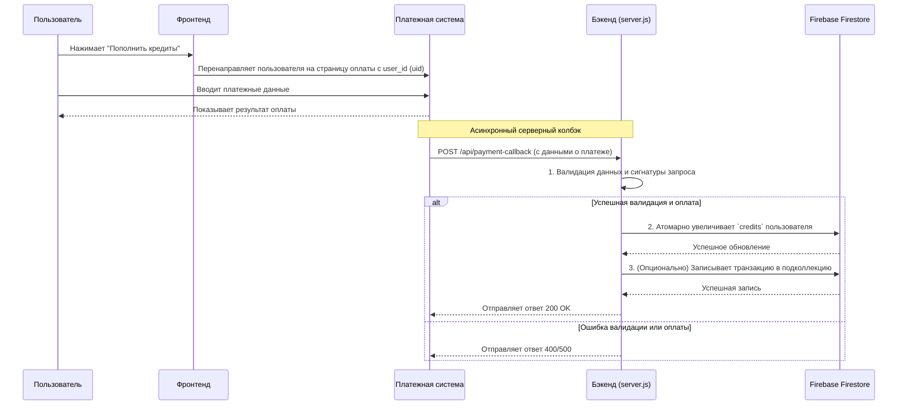

# Проектирование системы управления кредитами

Этот документ описывает архитектуру и дизайн системы для управления кредитами пользователей, их пополнения через внешнюю платежную систему и хранения данных в Firebase.

## 1. Структура данных в Firebase Firestore

Для хранения данных о кредитах пользователей рекомендуется использовать **Cloud Firestore** из-за его масштабируемости, гибкости запросов и модели безопасности.

### Коллекция `users`

-   Основная коллекция, где каждый документ представляет одного пользователя.
-   **ID документа:** `uid` пользователя из Firebase Authentication. Это обеспечивает прямую связь между аутентифицированным пользователем и его данными.

**Структура документа пользователя (`/users/{uid}`):**

```json
{
  "email": "user@example.com",
  "displayName": "John Doe",
  "credits": 100,
  "createdAt": "2023-10-27T10:00:00Z"
}
```

-   `credits`: (Number) Текущий баланс кредитов пользователя.

### Подколлекция `transactions`

-   Для ведения истории всех операций с кредитами (пополнения, списания) рекомендуется создать подколлекцию внутри каждого документа пользователя.
-   Это обеспечивает хорошую организацию данных и позволяет легко получать историю транзакций для конкретного пользователя.

**Структура документа транзакции (`/users/{uid}/transactions/{transactionId}`):**

```json
{
  "orderId": "PAYMENT_ORDER_ID_12345",
  "status": "completed",
  "amount": 250.50,
  "currency": "UAH",
  "creditsAdded": 50,
  "createdAt": "2023-10-27T12:30:00Z",
  "paymentSystem": "Название вашей системы"
}
```

-   `orderId`: Уникальный идентификатор заказа из платежной системы.
-   `status`: Статус платежа.
-   `amount`, `currency`: Сумма и валюта платежа.
-   `creditsAdded`: Количество начисленных кредитов.

## 2. Диаграмма процесса пополнения

Эта диаграмма иллюстрирует взаимодействие между пользователем, фронтендом, платежной системой, бэкендом и Firebase.



## 3. API Эндпоинт: `/api/payment-callback`

Этот эндпоинт будет обрабатывать веб-хуки (колбэки) от платежной системы.

-   **Метод:** `POST`
-   **Путь:** `/api/payment-callback`

### Ожидаемые данные в теле запроса (Request Body)

Тело запроса должно содержать информацию о платеже. Поля могут отличаться в зависимости от вашей платежной системы, но обычно включают:

```json
{
  "order_id": "UNIQUE_ORDER_ID",
  "order_status": "approved", // или другой статус успеха
  "amount": 10000, // в копейках или минимальных единицах
  "currency": "UAH",
  "user_id": "FIREBASE_USER_UID", // UID пользователя
  "signature": "CALCULATED_SIGNATURE" // Для верификации
}
```

### Логика обработки

1.  **Парсинг тела запроса:** Бэкенд должен использовать `express.json()` для парсинга входящих данных.
2.  **Валидация и безопасность (Критически важно!):**
    -   **Проверка сигнатуры:** Платежные системы отправляют `signature` (подпись), сгенерированную с помощью секретного ключа, который известен только вашему бэкенду и системе. Вы должны сгенерировать такую же подпись на своей стороне на основе полученных данных и сравнить ее с полученной. **Это защищает от поддельных запросов.**
    -   Проверить наличие всех обязательных полей (`order_id`, `order_status`, `amount`, `user_id`).
3.  **Обработка платежа:**
    -   Если `order_status` указывает на успешное завершение платежа:
        -   Определить количество кредитов для начисления на основе `amount`. (Например, 1 гривна = 1 кредит).
        -   Использовать `firebase-admin` для доступа к Firestore.
        -   Найти документ пользователя по `user_id` (который является `uid`).
        -   Использовать **атомарную операцию `FieldValue.increment()`** для безопасного увеличения поля `credits`. Это предотвращает гонку состояний, если пользователь совершает несколько действий одновременно.
        -   (Рекомендуется) Создать запись в подколлекции `transactions` для аудита.
4.  **Ответ платежной системе:**
    -   Отправить ответ с кодом `200 OK` и телом, которое ожидает платежная система (часто это просто `OK` или пустой ответ). Это подтверждает, что вы успешно получили и обработали колбэк.

## 4. Необходимые шаги для реализации

1.  **Установить `firebase-admin`:**
    ```bash
    # в директории backend
    npm install firebase-admin
    ```
2.  **Настроить Firebase Admin SDK:**
    -   В консоли Firebase сгенерировать ключ сервис-аккаунта (service account key) в формате JSON.
    -   Сохранить этот файл в безопасном месте на бэкенде (например, `backend/serviceAccountKey.json`) и добавить его в `.gitignore`.
    -   Инициализировать `firebase-admin` в `server.js` с использованием этих учетных данных.
    ```javascript
    const admin = require('firebase-admin');
    const serviceAccount = require('./path/to/your/serviceAccountKey.json');

    admin.initializeApp({
      credential: admin.credential.cert(serviceAccount)
    });

    const db = admin.firestore();
    ```
3.  **Добавить переменные окружения:**
    -   В файл `.env` на бэкенде добавить секретный ключ от платежной системы для проверки подписи.
    ```
    PAYMENT_SECRET_KEY=your_secret_key_from_payment_gateway